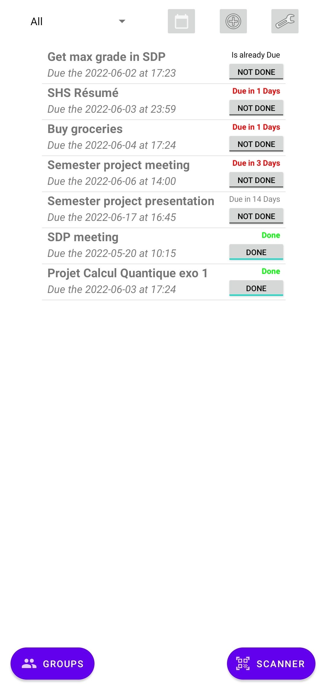
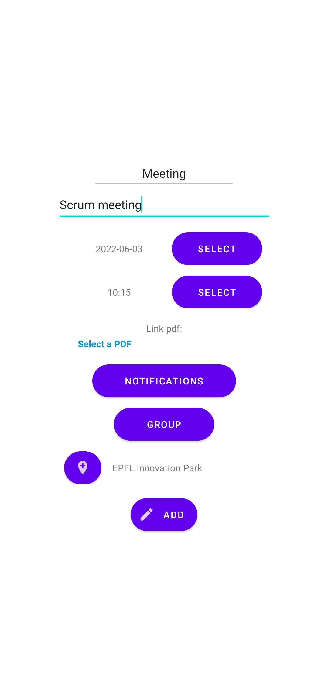
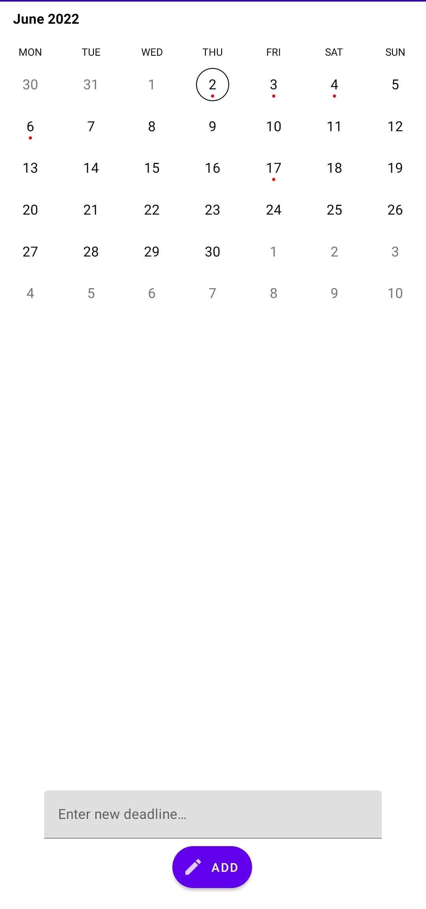
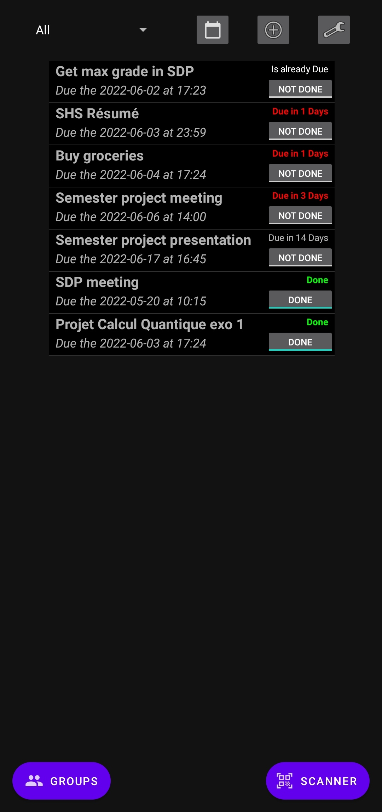
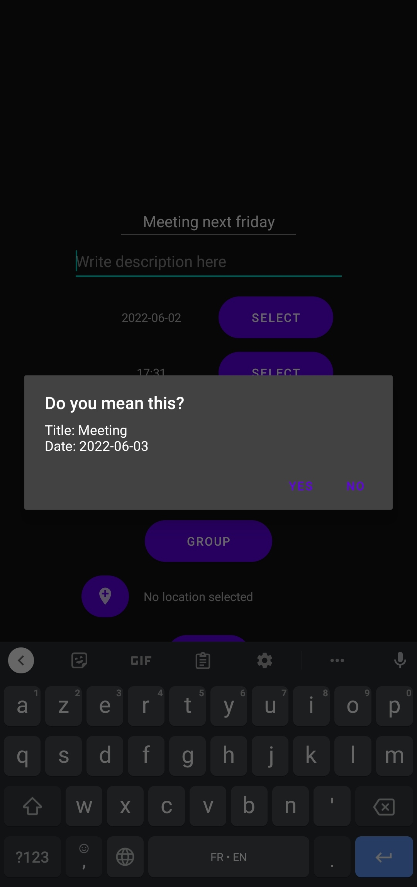
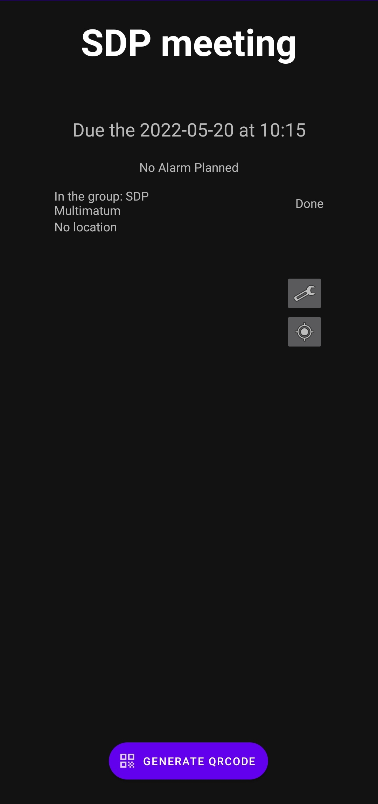
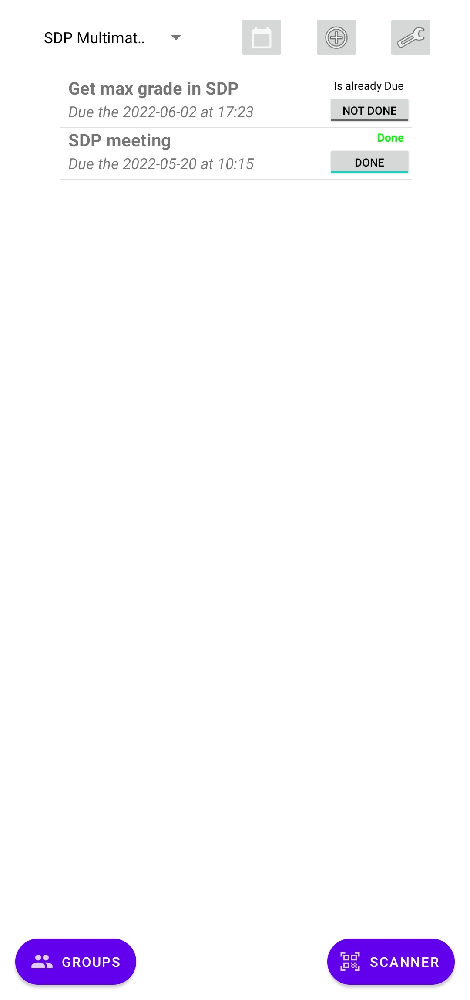
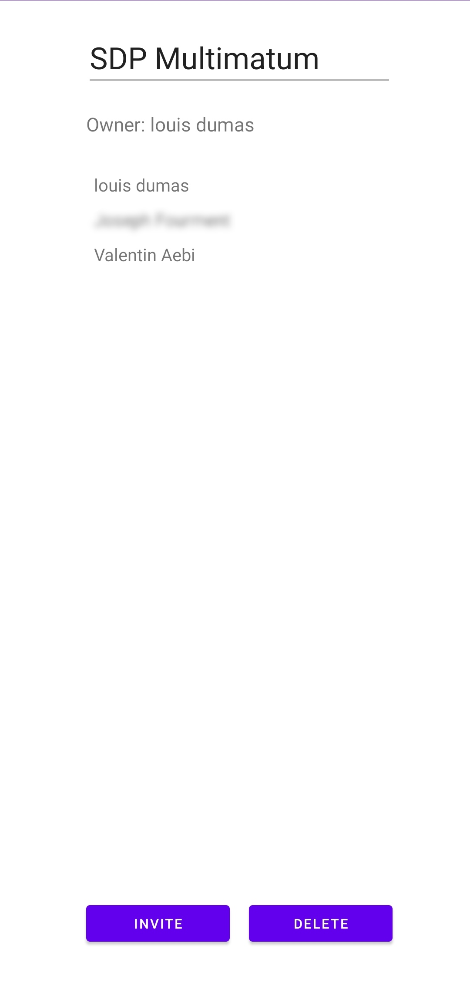

# multimatum

Multimatum is a deadlines manager application for Android, made for the
software development project course, spring semester 2022.
Its main purpose is to provide the user a easy tool to display, manage and even share all deadlines.

## Features

- Deadlines with title, description, date and time
- Date and time pre-selection based on title (e.g. entering "Meeting next
friday" as a title will automatically resolve the date)
- Upload files to associate them with deadlines
- Attach geolocation information to deadlines
- Notifications (optional)
- Procrastination fighter, which will harass you with notifications if you're
not working (based on device motion, optional)
- Sharing deadlines via QRCode
- Synchronization via Google accounts (optional)
- Creating groups of people working on common deadlines (only available when
signed-in with a Google account)
- Offline support
- Dark theme

## Building

To build the application, you'll need to add the `google-services.json` and
`credentials.json` in the `app` directory, containing the API keys to
Firebase.

Then, running the `./gradlew build` command will build the application and put
the APK in `build/intermediates/apk`, which you can then install on your
phone.

Alternatively, you can open the project with Android Studio and press the
'Run' button, which will run multimatum on the emulator or on your phone if
connected via USB.

## Screenshots

Here are a few screenshots to showcase a few of our app's features (hover for
description):

  
  
  
  
  
  
  
  
  

